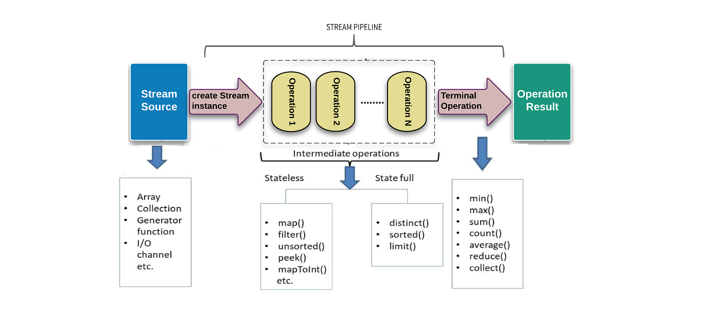
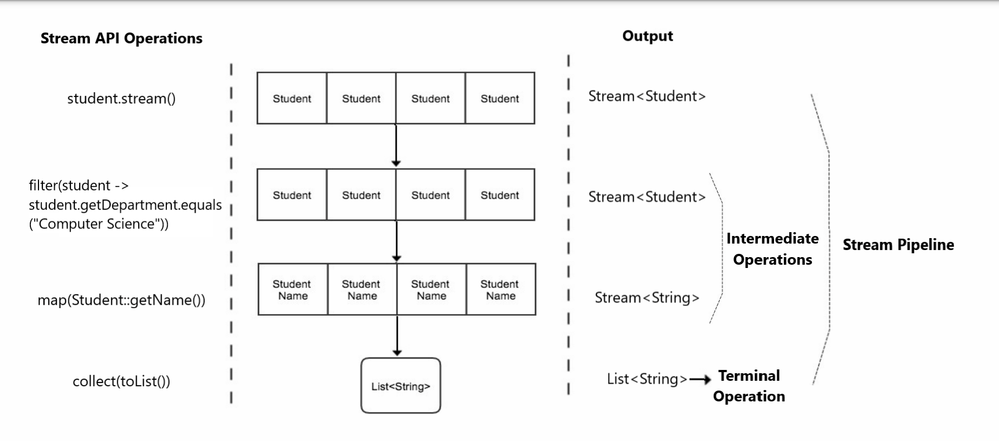

# Streams

Streams are the sequence of elements which can be created out of a collection such as List or Arrays or any kind of I/O resources.<br>
Streams got introduced in Java 8 and is included in `java.util.stream` package.

Parallel operations are also easy to perform with Stream API without having to spawn multiple threads.

Streams do not change the original data structure, they are created out of a collection of elements and provide the result 
as per the pipelined methods.<br>
Stream elements can be used only once, if an attempt is made to access it later `IllegalStateExeption` exception is thrown.

## Collections vs Streams

| Collection                                                                                                                                | Streams                                                                           |
|-------------------------------------------------------------------------------------------------------------------------------------------|-----------------------------------------------------------------------------------|
| If there is need to represent a group of individual objects as single entity, Collection should be preferred.                             | If there is need to process a collection of objects, Streams should be preferred. |
| Can add or modify elements <br>Example: **List:** `list.add(element) `                                                                    | Cannot add or modify elements in a stream. It is a fixed data set.                |
| Elements in the collection can be accessed in any order. Use appropriate method based on collection <br/>Example: **List:** `list.get(4)` | Elements in the Stream can be accessed only in sequence, one by one.              |
| Collections are eagerly constructed                                                                                                       | Streams are lazily constructed.                                                   |
| Collections can be traversed "n" number of times.                                                                                         | Streams can be traversed only once.                                               |

- `default Stream stream()` is a default method added to **Collection** interface in Java 1.8.
- A Stream object can be created out of a  Collection using the `stream()` method of Collection interface. 
 <br>Example: `Stream s = list.stream();`

## Advantages of using Stream:

- Efficient and shorter, removes lots of boilerplate code.
- Provides a very easy way to do parallel computation without having to worry about the multi-threaded implementations.
- Provides a large set of operations (built-in operations) that covers the common data processing scenarios.
- Provides a more memory efficient way, as the stream is closed once it's consumed, and there are no extra objects and variables
created which lingers on, waiting to be garbage collected.
- With the use of lambda expression, a wide range of functionalities can be implemented.

### Example : Collecting even numbers from a list

**withous streams:**
```java
// source list
List<Integer> numbersList = Arrays.asList(10, 15, 20, 25);

//target list
List<Integers> evenNumbersList = new ArrayList<>();
for(int n: numbersList){
    if(n % 2 == 0){
        evenNumbersList.add(n);
    }
}
```

**with streams:**
```java
// source list
List<Integer> numbersList = Arrays.asList(10, 15, 20, 25);

// target list
List<Integer>evenNumbersList = numbersList.stream()
                                .filter(i -> i % 2 == 0)
                                .collect(Collectors.toList());
```

## Stream pipeline:

A stream pipeline consists of a stream source, zero or more intermediate operations and a terminal operation.



### Stream source

The stream can be generated from Array, Set, List, Map or any Collection or any kind of I/O resources.

Examples:
```java
String [] fruits = new String[]{"apple","orange","banana","pineapple","oranges","apple","mango"};
Stream<String> fruitsStream = Arrays.stream(fruits);
```

```java
ArrayList<String> fruits = new ArrayList<>();
fruits.add("apple");
...
Stream<String> fruitStream = fruits.stream()
```

```java
Stream<String> fruitStream = Stream.of("apple", "oranges", "banana","pineapple","guava","apple","mango");
```

### Intermediate operations

In a stream pipeline, there can be one or more intermediate operations. And each intermediate operation consumes a stream 
and produces another stream as per the implemented logic.

Intermediate operations can be of two types
1. Stateless:
    - Stateless operations do not maintain any state from one element to another while processing the stream. 
    - Each element is processed independently, and the operation does not rely on the order or previous elements in the stream.
    - Examples: `filter`, `map`, `flatMap`, `peek`, etc.
2. Stateful:
    - Stateful operations, on the other hand, may maintain state or accumulate information while processing the elements of the stream. 
    - The result of these operations depends on the order and values of previous elements in the stream.
    - Examples; `distinct`, `sorted`, `limit`, etc.

Intermediate operations:
- filter
- map
- flatMap
- peek
- distinct
- sorted
- limit 
- skip


### Terminal operations

The terminal operation consumes the stream, but does not produces a stream, instead produces some result.

In a stream pipeline, there can be only one terminal operation. Terminal operations starts the entire stream pipeline.

Terminal operations:
- min
- max
- sum
- count
- average
- reduce
- collect
- forEach
- anyMatch
- allMatch
- noneMatch
- findFirst
- findAny

>Note:<br>
> Streams are lazy, no intermediate operations will be invoked until the terminal operation is applied.<br>
> The terminal method starts the pipeline<br>
> Each intermediate operation is lazily executed and returns a stream as a result, hence various intermediate operations
> can be pipelined. Terminal operations mark the end of the stream and return the result.

## Sample class and data for Stream method demonstration
<details>
  <summary>Student class and Data: click to expand/collapse</summary>

   ```java
   import java.util.ArrayList;
   import java.util.Arrays;
   import java.util.List;
   
   public class Student {
      private String name;
      private String gender;
      private String department;
      private int rollNo;
      private List<String> activities;
   
      public Student(String name, String gender, String department, int rollNo, List<String> activities) {
         this.name = name;
         this.gender = gender;
         this.department = department;
         this.rollNo = rollNo;
         this.activities = activities;
      }
   
      public String getName() {
         return name;
      }
   
      public void setName(String name) {
         this.name = name;
      }
   
      public String getGender() {
         return gender;
      }
   
      public void setGender(String gender) {
         this.gender = gender;
      }
   
      public String getDepartment() {
         return department;
      }
   
      public void setDepartment(String department) {
         this.department = department;
      }
   
      public int getRollNo() {
         return rollNo;
      }
   
      public void setRollNo(int rollNo) {
         this.rollNo = rollNo;
      }
   
      public List<String> getActivities() {
         return activities;
      }
   
      public void setActivities(List<String> activities) {
         this.activities = activities;
      }
   
      @Override
      public String toString() {
         return "Student{" +
                 "name='" + name + '\'' +
                 ", gender='" + gender + '\'' +
                 ", department='" + department + '\'' +
                 ", rollNo=" + rollNo +
                 ", activiteis=" + activities +
                 '}';
      }
   
      public static List<Student> getAllStudents(){
         List<Student> students = new ArrayList<>();
         // Computer Science students
         students.add(new Student("Aarav", "Male", "Computer Science", 101, Arrays.asList("Sports", "Coding Club")));
         students.add(new Student("Rohan", "Male", "Computer Science", 102, Arrays.asList("Music", "Coding Club")));
         students.add(new Student("Isha", "Female", "Computer Science", 103, Arrays.asList("Sports", "Coding Club")));
         students.add(new Student("Ishita", "Female", "Computer Science", 104, Arrays.asList("Photography", "Coding Club")));
         students.add(new Student("Sahil", "Male", "Computer Science", 105, Arrays.asList("Art", "Coding Club")));
   
         // Mechanical Engineering students
         students.add(new Student("Rohan", "Male", "Mechanical Engineering", 201, Arrays.asList("Dance", "Photography")));
         students.add(new Student("Sia", "Female", "Mechanical Engineering", 202, Arrays.asList("Photography", "Debate Club")));
         students.add(new Student("Rishi", "Male", "Mechanical Engineering", 203, Arrays.asList("Dance", "Robotics Club")));
         students.add(new Student("Aryan", "Male", "Mechanical Engineering", 203, Arrays.asList("Guitar Club", "Photography")));
   
         // Electrical Engineering Students
         students.add(new Student("Aryan", "Male", "Electrical Engineering", 301, Arrays.asList("Music", "Robotics Club")));
         students.add(new Student("Ved", "Male", "Electrical Engineering", 302, Arrays.asList("Music", "Robotics Club")));
         students.add(new Student("Varun", "Male", "Electrical Engineering", 303, Arrays.asList("Photography", "Debate Club")));
         students.add(new Student("Nisha", "Female", "Electrical Engineering", 304, Arrays.asList("Music", "Debate Club")));
   
         // Civil Engineering Students
         students.add(new Student("Arjun", "Male", "Civil Engineering", 401, Arrays.asList("Photography", "Guitar Club")));
         students.add(new Student("Kavya", "Female", "Civil Engineering", 402, Arrays.asList("Photography", "Photography")));
         students.add(new Student("Karan", "Male", "Civil Engineering", 403, Arrays.asList("Sports", "Robotics Club")));
         students.add(new Student("Anika", "Female", "Civil Engineering", 404, Arrays.asList("Sports", "Guitar Club")));
   
         // Information Technology Students
         students.add(new Student("Neha", "Female", "Information Technology", 501, Arrays.asList("Music", "Art")));
         students.add(new Student("Ravi", "Male", "Information Technology",502, Arrays.asList("Coding Club", "Guitar Club")));
         students.add(new Student("Tanvi", "Female", "Information Technology", 503, Arrays.asList("Dance", "Robotics Club")));
         students.add(new Student("Diya", "Female", "Mechanical Engineering", 504, Arrays.asList("Robotics Club", "Debate Club")));
   
   
         // Electronics and Communication Engineering students
         students.add(new Student("Raj", "Male", "Electronics and Communication Engineering", 601, Arrays.asList("Sports", "Guitar Club")));
         students.add(new Student("Rahul", "Male", "Electronics and Communication Engineering", 602, Arrays.asList("Sports", "Music")));
         students.add(new Student("Prachi", "Female", "Electronics and Communication Engineering", 603, Arrays.asList("Dance", "Debate Club")));
         students.add(new Student("Diya", "Female", "Electronics and Communication Engineering", 604, Arrays.asList("Robotics Club", "Debate Club")));
   
   
         return students;
      }
   }

   ```
</details>

[Student class and Sample data](./data/Student.java)

### Stream pipeline Demonstration:
```java
/*
 * Example demonstrating the Stream pipeline
 */

import streams.data.Student;

import java.util.List;
import java.util.stream.Collectors;

public class StreamPipelineExample {
   public static void main(String[] args) {

      List<String> computerScienceStudents = Student.getAllStudents().stream() //Stream<Student>
              .filter(student -> student.getDepartment().equals("Computer Science")) //Stream<Student>
              .map(Student::getName) //Stream<String>
              .collect(Collectors.toList());

      System.out.println("Computer Science students: " + computerScienceStudents);
   }
}
```


<details>
  <summary>Output: Click to expand/collapse</summary>

  ```shell
    Computer Science students: [Aarav, Rohan, Isha, Ishita, Sahil]
  ```
</details>



[Example: Stream Pipeline](./StreamPipelineExample.java)

> Note: <br>
> In stream pipeline each element is passed one by one through the pipeline operation.<br>
> i.e: all the pipeline operation are performed for 1st element before going for the 2nd element

----

## Steam API factory methods

### **of**

`static Stream of(T... values)`

- Returns a sequential ordered stream whose elements are the specified values.
- creates a stream of values passed to this method. There can be one or more values. <br>

```java
Stream<String> fruitStream = Stream.of("apple", "oranges", "banana", "pineapple", "guava", "apple", "mango");
```

### iterate

`static Stream iterate(T seed, UnaryOperator<T> f)`

- Returns an infinite sequential ordered Stream produced by iterative application of a function **f** to an initial element
  **seed**, producing a Stream consisting of **seed, f(seed), f(f(seed)), ...., etc.**
- The first element (index 0) in the Stream will be provided seed.
- For **n > 0**, the element at position **n**, will be the result of applying the function **f** to the element at position **n-1**.
- Note: `limit(maxSize)` can be used to limit this infinite stream. <br>

```java
Stream<Integer> stream = Stream.iterate(1, x -> x*2);
```

### generate

`static Stream generate(Supplier s)`

- Returns an infinite sequential unordered Stream where each element is generated by the provided supplier.
- This is suitable for generating constant streams, stream of random elements, etc.
- Note: `limit(maxSize)` can be used to limit this infinite stream.

```java
Supplier<Integer> intSupplier = new Random()::nextInt;
Stream<Integer> randomIntStream = Stream.generate(intSupplier);
```

[Example: Stream Factory Methods](./StreamFactoryMethodsExample.java)

---
